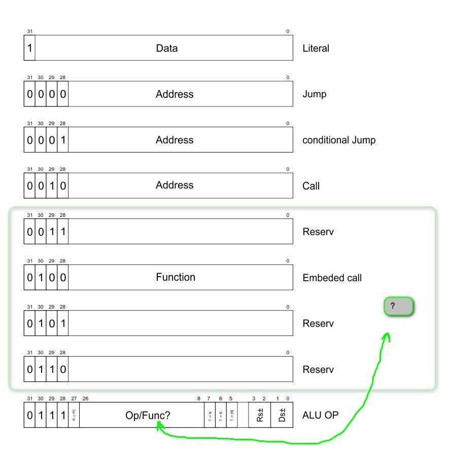
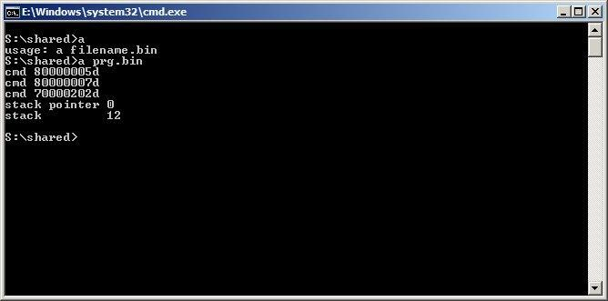
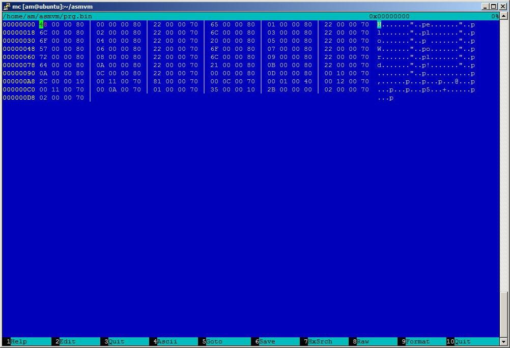

# Own Forth Bytecode Compiler

Just a attempt to implement a own bytecode compiler.

A attempt to write a VM/compiler for One Programming Language. It's a own forth **virtual machine** (VM).

**Date:** 2019-2020

## Input

Thee cmd.txt is:

```
003a 2074 7420 7322 2048 656c 6c6f 2c20
776f 726c 6421 0a22 203b 0a74 740a 7479
7065 0a62 7965 0a0a
```

$ cat cmd.txt 

```
: tt s" Hello, world!
" ;
tt
type
bye
```

## Benchmark

_test.c_:
```c
#include <stdio.h>
int main(int argc, char const *argv[]) {
  printf("Hello, world! *************!\n");
  return 0;
}
```

C program:

```
$ gcc test.c -o test
$ time ./test
real  0m0.001s
user  0m0.001s
sys  0m0.000s
```

Own VM:

```
$ time ./123
real  0m0.003s
user  0m0.003s
sys  0m0.000s
```
#### How to debug machine code?

```
readelf -sW ./123 > readelf.txt
objdump -d 123 > objdump.txt
```

### Figure

Whether additional functions should be distinguished into a separate category or not.
while leaning towards some redundancy.

This is bytecode (structure) for vm.



---------------

## Second step: rewrite functions with new structure

So newfile is: `forth-second.c`



Out input file is `cat prg.bin`.

Try in Windows:
```
x86_64-w64-mingw32-g++ forth.c -static
```

Try in GNU/Linux:
```
gcc forth.c -o forth                                            
./forth prg.bin     
```

-------

## Third step:



```
$ gcc forh-third.c -o forth
$ ./forth prg-third.bin 
Hello World!
```

I'm working on mnemonics, step by step completing vm:

```
nop    0x70000000
push   0x80000000 | 0x3FFFFFF ( max ) 0x7FFFFFFF (-min)
add    0x70000202 A,B -> A+B
xor    0x70000502 A,B -> A^B
and    0x70000302 A,B -> A&B
or     0x70000402 A,B -> A|B
invert 0x70000600 A   -> ~A
=      0x70000702 A,B -> (A==B)?1:0
<      0x70000802 A,B -> (A<B)?1:0
>r     0x70000046 A   -> ,R
r>     0x70000B89 R,  -> A
r@     0x70000B81 R,  -> R, A
swap   0x70000180 A,B -> B,A
dup    0x70000001 A   -> A,A
drop   0x70000002 A   -> 
u<     0x70000F02 A,B -> (Abs(A)<Abs(B))?1:0
```

> warn: prg.bin is LittleEndian


## Fourth step

Commands:
```
nop    0x70000000
push   0x80000000 | 0x3FFFFFF ( max ) 0x7FFFFFFF (-min)

dup    0x70000001 A     -> A,A
drop   0x70000002 A     ->
over   0x70000181 A,B   -> A,B,A
rot    0x70001100 A,B,C -> B,C,A
swap   0x70000180 A,B   -> B,A
pick   0x70001301 An,An-1,An-2...,n -> An,An-1,An-2...,An
roll   0x70001402 An,An-1,An-2...,n -> An-1,An-2...,An
.      0x40000200 A -> printf("%d ",A)

+      0x70000202 A,B -> A+B
add    0x70000202 A,B -> A+B
-      0x70001502 A,B -> A-B
sub    0x70001502 A,B -> A-B
*      0x70001602 A,B -> A*B
mul    0x70001602 A,B -> A*B
2mul   0x70001700 A,B -> lo(A*B),hi(A*B)
/      0x70001802 A,B -> A/B
mod    0x70001902 A,B -> mod(A/B)  
/mod   0x70001A00 A,B -> mod(A/B), A/B


xor    0x70000502 A,B -> A^B
and    0x70000302 A,B -> A&B
or     0x70000402 A,B -> A|B
invert 0x70000600 A   -> ~A
=      0x70000702 A,B -> (A==B)?1:0
<      0x70000802 A,B -> (A<B)?1:0
>r     0x70000046 A   -> ,R
r>     0x70000B89 R,  -> A
r@     0x70000B81 R,  -> R, A
u<     0x70000F02 A,B -> (uA<uB)?1:0
1+     0x70001200 A   -> A+1
```

### So result?


© Copyright 2019 Max Base, ValK
